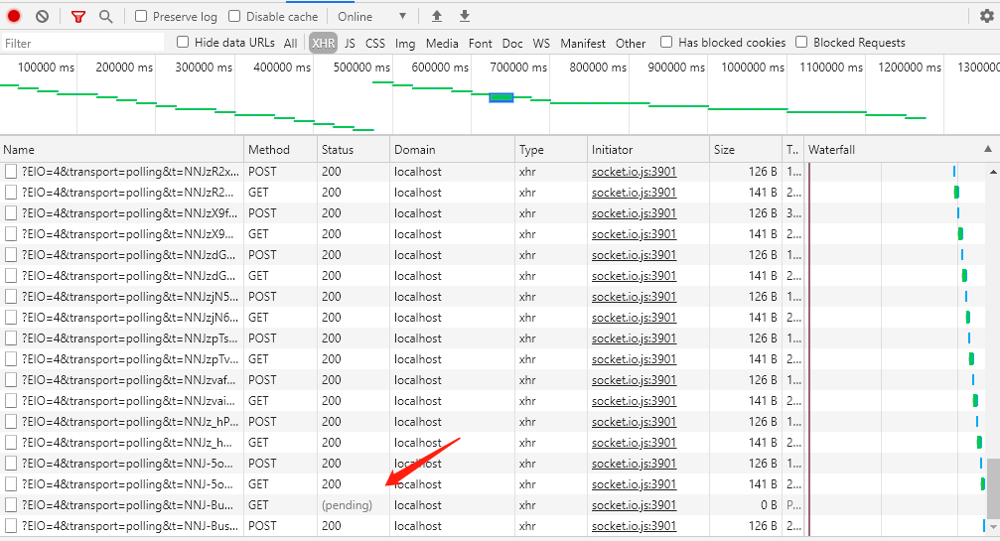

## websocket
[websocket兼容性](https://caniuse.com/?search=websocket)

## 简单DEMO
客户端：
```
//./client/index.html
var socket = new WebSocket("ws://localhost:3000/test/123");
var timmer;
socket.onopen = function (evt) {
    console.log('open',evt);
    timmer = setInterval(function(){
        socket.send(new Date().getSeconds());
    },1000)
};
//收到消息 触发回调
socket.onmessage = function (evt) {
    console.log('msg',evt);
};

socket.onerror = function (evt) { //失败重连 
    console.log('e',evt);
    clearInterval(timmer);
};
```

服务端：
```
//./server/index.js
const Koa = require('koa');
const route = require('koa-route');
const websockify = require('koa-websocket');

const app = websockify(new Koa());

// Regular middleware
// Note it's app.ws.use and not app.use
app.ws.use(function(ctx, next) {
    // return `next` to pass the context (ctx) on to the next ws middleware
    return next(ctx);
});
  
// Using routes
app.ws.use(route.all('/test/:id', function (ctx) {
    // `ctx` is the regular koa context created from the `ws` onConnection `socket.upgradeReq` object.
    // the websocket is added to the context on `ctx.websocket`.
    ctx.websocket.send('Hello World');
    ctx.websocket.on('message', function(message) {
      // do something with the message from client
          console.log(message);
    });
}));

app.listen(3000);
```

## websocket什么时候会断开
### 客户端原因
比如断网、关闭浏览器，这些服务端可以通过close事件进行监听

### 服务端原因

服务端不做任何动作就关闭链接（直接退出进程，或者抛出错误或者重启）。

服务端异常断开重启后，客户端需要重新```new websocket```才能重新连接上

在客户端：
第一次连接失败会提示：

```index.html:10 WebSocket connection to 'ws://xxxx' failed: Error in connection establishment: net::ERR_CONNECTION_REFUSED```

这时候会触发WebSocket实例的onerror、onclose回调函数执行

注意:

服务端意外报错或者关闭（调用websocket.terminate()）时，在chrome浏览器下,onerror函数并不会触发,而是触发onclose函数

而在firefox下，服务端报错时触发onerror，关闭时触发onclose

而在IE10下,服务端报错时onerror和onclose函数都会触发，并提示```WebSocket Error: Network Error 12030, 与服务器的连接意外终止```

    所以在onerror和onclose中，只用onclose是个不错的选择

连接成功后如果后面服务端关闭，而客户端执行```socket.send```，chrome控制台会报错(其他浏览器不会)：```WebSocket is already in CLOSING or CLOSED state.```

并且把错误栈指向我的代码：```socket.send```

控制台会提示你WebSocket正在关闭或者已经关闭。
注意！上述的连接失败、发送数据失败，用```try catch```、```window.onerror```、```window.addEventListener('error',function(){})```都无法监听、捕获该异常。所以用WebSocket实例的onclose函数阻止```socket.send```执行是最佳选择

### 为什么需要心跳机制？
websocket会不会主动断开（这里的意思是如果长时间双方都没有数据来往，会不会自动断开）?

在我的node服务上，我发现就算没有心跳，websocket也能一直连接着（我承认只观察了2h），那么收集下网上的说法：
- nginx会主动关闭websocket

我们用ngnix开启反向代理：
```
server {
    listen 80;
    server_name  node-test.com;
    location / {
        proxy_pass http://localhost:3000;
        proxy_next_upstream error timeout invalid_header http_500 http_502 http_503;
        proxy_set_header Host $host;
        proxy_http_version 1.1; 
        proxy_set_header X-Real-IP $remote_addr;
        proxy_set_header X-Forwarded-For $proxy_add_x_forwarded_for;
        proxy_set_header X-Forwarded-Proto https;
        proxy_set_header Upgrade $http_upgrade;  
        proxy_set_header Connection "upgrade"; 
        proxy_set_header Origin "";
    }
}
```
果然没一会儿就触发close事件，所以等到关闭的时候再来重新连接，不如用一个心跳机制让他保持不断开。

考虑一件事就是：close事件是否肯定触发，让ngnix不设置超时时间，而通过onclose事件去判断是否需要重连是否会更加低成本？（心跳也算成本）

#### 小结
处理websocket服务端的断开，使用onclose可有效解决浏览器兼容性问题
websocket除了监听自身的error，close状态，无其他手段进行异常监听

# websocket尝试传输文件
to do

# node的websocket库
## socket.io  github 51.6 stars
如果客户端要使用该库，服务端也要相应的配合使用该库，目前支持node.js、java、C++、Swift、Dart（PHP：“我大意了啊，没有s”）

特性(简单翻译下官网给的特性+解释)
- 可靠性，可以用在：代理、负载均衡、个人防火墙、反病毒软件
- 自动重连支持
- 断开连接检测
- 二进制支持（浏览器：ArrayBuffer、Blob;Node.js:ArrayBuffer、Buffer)
- 简单方便的api
- 跨浏览器
- 多路复用支持（就是以命名空间为单位，创建任意个对象，便于管理，但是底层还是用的同一个socket连接）
- 支持Room（支持以命名空间为单位，实现分组，用在群聊天等方面）

### 保持长连接的原理

他的核心是用了[Engine.IO](https://github.com/socketio/engine.io)这个库,该库先发起长连接（LongPolling），并尝试升级连接（换成websocket）
他所谓的长连接长什么样，为了看到清楚点，我在客户端一开始就```WebSocket = undefined;```，然后可以在控制台看到以下截图：



可以看到除了第一次会发起5个请求，之后每次会发起2个请求，其中一个会处于pending状态，持续一段时间。这段时间内如果服务器有数据要推过来，会请求成功，否则这段时间过后也会自动请求成功并又再起发起两个请求。以下贴一段引用：

    LongPolling
    Browser/UA发送Get请求到Web服务器，这时Web服务器可以做两件事情，第一，如果服务器端有新的数据需要传送，就立即把数据发回给Browser/UA，Browser/UA收到数据后，立即再发送Get请求给Web Server；第二，如果服务器端没有新的数据需要发送，这里与Polling方法不同的是，服务器不是立即发送回应给Browser/UA，而是把这个请求保持住，等待有新的数据到来时，再来响应这个请求；当然了，如果服务器的数据长期没有更新，一段时间后，这个Get请求就会超时，Browser/UA收到超时消息后，再立即发送一个新的Get请求给服务器。然后依次循环这个过程。

    这种方式虽然在某种程度上减小了网络带宽和CPU利用率等问题，但是仍然存在缺陷，例如假设服务器端的数据更新速率较快，服务器在传送一个数据包给Browser后必须等待Browser的下一个Get请求到来，才能传递第二个更新的数据包给Browser，那么这样的话，Browser显示实时数据最快的时间为2×RTT（往返时间），另外在网络拥塞的情况下，这个应该是不能让用户接受的。另外，由于http数据包的头部数据量往往很大（通常有400多个字节），但是真正被服务器需要的数据却很少（有时只有10个字节左右），这样的数据包在网络上周期性的传输，难免对网络带宽是一种浪费。

    通过上面的分析可知，要是在Browser能有一种新的网络协议，能支持客户端和服务器端的双向通信，而且协议的头部又不那么庞大就好了。WebSocket就是肩负这样一个使命登上舞台的。


## ws  github 15.2 stars
看express-ws的源码可以发现用的是ws库，koa-websocket也是

socket.io vs ws

可以先看下这个结论，理性看待，具体使用哪个看情况（主要考虑后端语言、浏览器兼容性）
[Differences between socket.io and websockets](https://stackoverflow.com/questions/10112178/differences-between-socket-io-and-websockets/38558531#38558531)

# 注意
如果你的服务所在的域是HTTPS，那么使用的WebSocket协议也必须是wss, 而不能是ws

# 本人在项目中的使用websocket的总结
## 如何稳定的实时更新数据

项目后台为PHP（所以没有用socket.io），采用ajax轮询 + websocket的方式，在一定程度上保证了数据获取的稳定性，并兼容不支持websocket的浏览器。

## 对于历史socket数据如何调试
后端导出历史数据，前端复现

两种做法：
- 将数据作为变量写进页面脚本里
- 本地使用node读取数据并建立websocket

显然第二种做法对源代码的入侵性较低，客户端只需要改一下socket地址即可

# 参考资料

[nodejs消息推送之socket.io 与 ws对比](https://blog.csdn.net/swimming_in_it_/article/details/81451491)

[ws](https://github.com/websockets/ws)

[socket.io](https://github.com/socketio/socket.io)

[转载：WebSocket 原理介绍及服务器搭建](https://blog.csdn.net/qq_39101111/article/details/78627393)


