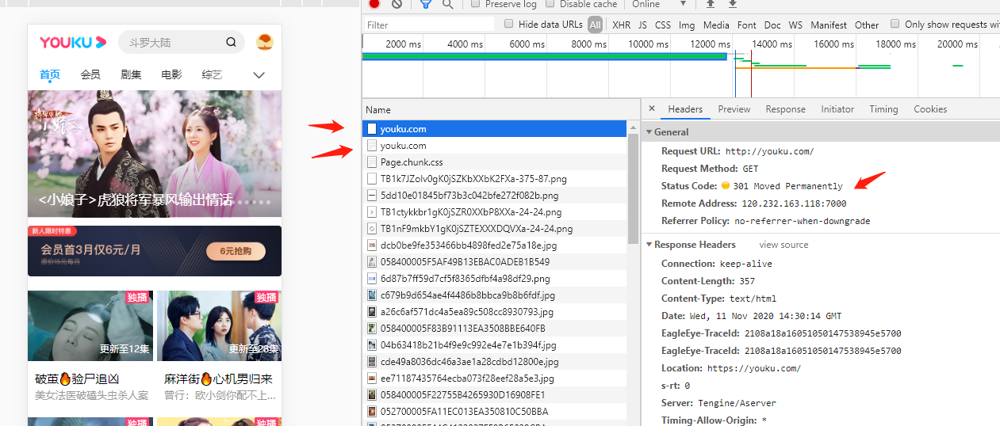
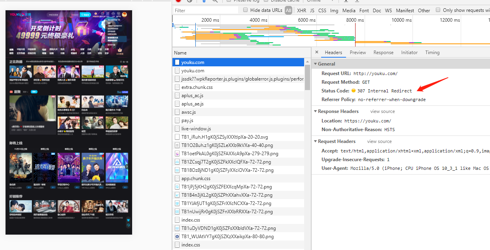

# 起因
在合作优酷项目时，数据是通过```lib.mtop.request```获取的，而该函数由优酷提供，在其app里的webview中调用可以获取登录等信息，而这本地开发调试时就出现了困难。一开始我猜想在http://youku.com里登录，然后再将我的本地项目(127.0.0.1)指向youku.com:80,应该也可以登录，所以有了下面的故事:

在登录优酷网站后，开启host，本地项目地址设置为youku.com,再次访问时，发现怎样都访问不了本地ip，会自动跳转到优酷网站上，并且http还会变成https

# 301,302,307
观察到，首次访问http://youku.com时，会看到301 Moved Permanently,然后紧接着就是跳转到https://youku.com

第二次访问http://youku.com时，会看到307 Internal Redirect,并且Response Headers里返回了Non-Authoritative-Reason:HSTS

## 301代表永久性转移（301 Moved Permanently）
301 代表永久性转移,转移到Response Headers里Location指定的网址，当你想要换网址却又不想影响排名时，用301,权重方面会渐渐转移给目标网站。(有人实测，原网站权重在一段时间内权重不会下降，并会拥有目标网站的关键字排名)

## 302暂时性转移(Temporarily Moved )和307（Temporary Redirect）
302表示旧地址A的资源还在（仍然可以访问），这个重定向只是临时地从旧地址A跳转到地址B，搜索引擎会抓取新的内容而保存旧的网址。

所以会存在一种作弊方法，将自己网站先通过302链接到排名靠前的网站，提高自己的搜索权重，过段时间再换回来，但是搜索引擎也有可能发现你在作弊并给予惩罚

    “状态码 307 与 302 之间的唯一区别在于，当发送重定向请求的时候，307 状态码可以确保请求方法和消息主体不会发生变化。如果使用 302 响应状态码，一些旧客户端会错误地将请求方法转换为 GET：也就是说，在 Web 中，如果使用了 GET 以外的请求方法，且返回了 302 状态码，则重定向后的请求方法是不可预测的；但如果使用 307 状态码，之后的请求方法就是可预测的。对于 GET 请求来说，两种情况没有区别。”


# HSTS是什么

    HTTP Strict Transport Security (通常简称为HSTS) 是一个安全功能，它告诉浏览器只能通过HTTPS访问当前资源, 禁止HTTP方式。

载选自HTTP Strict Transport Security：

    An HSTS enabled server can include the following header in an HTTPS reply:

        Strict-Transport-Security: max-age=16070400; includeSubDomains

    When the browser sees this, it will remember, for the given number of seconds, that the current domain should only be contacted over HTTPS. In the future, if the user types http:// or omits the scheme, HTTPS is the default. In fact, all requests for URLs in the current domain will be redirected to HTTPS. (So you have to make sure that you can serve them all!). 
    
这个https返回Strict-Transport-Security我是在控制太没看到，但是可以确定的是，他确实在发挥这作用，通过chrome浏览器中访问chrome://net-internals/#hsts,可以在Delete domain security policies处删除

# 设置host文件也不起作用？
我访问了https://youku.com/成功一次之后，我在host文件里设置了
```127.0.0.1 youku.com```
发现还是能正常访问优酷...
这要我想到一个经典面试，“浏览器输入地址后发生了什么？”

首先浏览器先*缓存解析*

然后才是域名解析：
通过域名查找对应的服务器IP
- 在本地vhosts文件中查找
- 在本地DNS服务器中查找
- 本地DNS服务器向根DNS服务器发送请求，根DNS服务器会返回一个域服务器（.com服务器）地址
- 本地DNS服务器向域服务器发送请求，域服务器返回一个域名解析服务器地址
- 本地DNS服务器向域名解析服务器发送请求，获得服务器ip地址
- 本地DNS服务器缓存查询结果，并告知浏览器

我又ping了一下地址，发现已经指向了127.0.0.1，那么确实问题在于浏览器
所以我访问chrome://net-internals/#dns，然后Clear host cache,没用！
原来我浏览器装了代理插件，ip在他那又缓存了一次

这时好奇一件事，代理软件，是在hosts文件前还是后生效的，实测了一下，是在hosts之前就生效的，这个得注意下

# 结论
要阻止localhost下http跳转https的问题

1. 是否存在HSTS,如果有，访问 chrome://net-internals/#hsts 进行处理

2. 浏览器是否开启了代理插件，电脑是否开启了代理软件，有则关闭

# 其他
最后，还是模拟登录失败。事实证明就算域名一样，共用cookie这些还是没法登录。lib.mtop.request是阿里内部用的工具，不对外开放，作为合作方，我们最终的解决方案是用两套接口，开发时调用自己的接口，通过优酷提供openid给我们操作（操作时也是调用自己的接口，其实就是模拟优酷服务器访问我们服务器的方式）：

线上：用户=》优酷APP操作=》优酷服务器=》我们自己的服务器

开发：开发人员+优酷提供openid=》我们自己的服务器


# 参考资料
[http状态码301和302详解及区别](https://blog.csdn.net/zhouchangshun_666/article/details/79354193)

[307 Temporary Redirect](https://developer.mozilla.org/zh-CN/docs/Web/HTTP/Status/307)

[多次301跳转，权重怎么转移？](https://www.zhihu.com/question/31845218)

[301快被我玩坏了](https://zhuanlan.zhihu.com/p/20101481)

[简单易懂HSTS，你需要它！](https://juejin.im/post/6844903952211771405)

[HTTP Strict Transport Security](https://www.chromium.org/hsts)