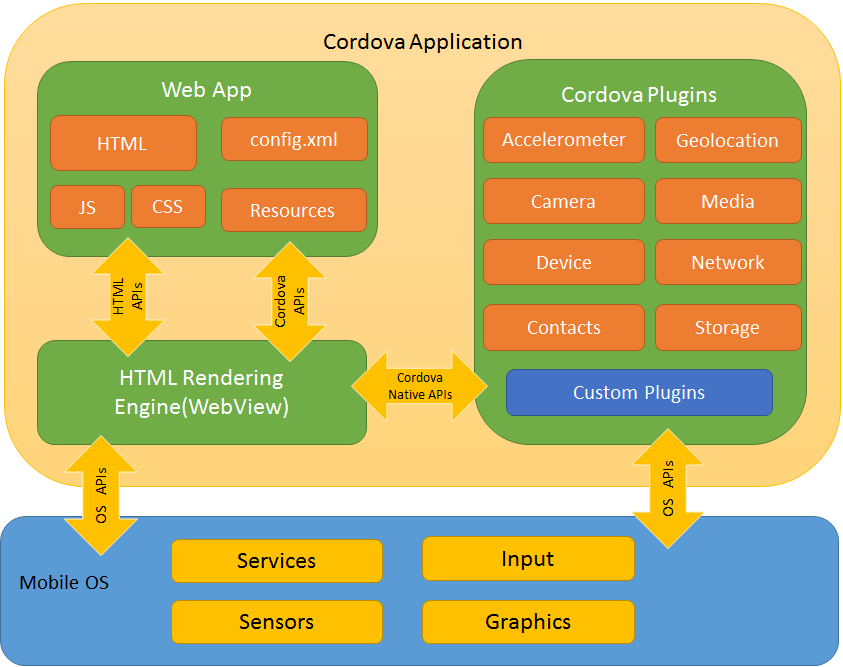
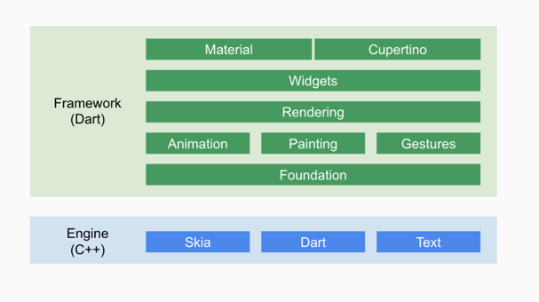

# 跨端App有三种形式
## 1.webview + JSBridge（H5+原生混合）
通过原生webview组件，进而利用web排版技术进行UI显示，并且由js与原生系统进行双向通讯
代表有：cordova, Tonic, 微信小程序

    而混合框架一般都会在原生代码中预先实现一些访问系统能力的API，然后暴露给 Webview以供 Javascript调用，这样一来， Webview就成为 Javascript与原生AP之间通信的桥梁，主要负责 Javascript与原生之间调用消息的传递，而消息的传递必须遵守一个标准的协议，其规定了消息的格式与含义，我们将依赖于 Webview的、用于在 Javascript与原生之间通信并实现了某种消息传输协议的工具称为 Webview Javascript Bridge，简称 Jsbridge，它也是混合开发框架的核心.

### cordova

## 2.js开发+原生渲染
hybird 就是混合的意思。主要特点就是最后渲染得都是 *native UI*。

原理是利用js（虚拟dom）生成原生UI和写业务逻辑，配合自研布局引擎处理css，也是由js与原生通讯
代表有：react native, weex, 快应用
## 3.自定义渲染机制 + DSL
自己开发一套渲染引擎，UI画在一块画布上
代表有：flutter, QT Mobile

# flutter与react native的区别
## react native技术架构及原理
RN中虚拟DOM会通过 JavaScriptCore 映射为原生控件树

JavaScriptCore 是一个JavaScript解释器，它在React Native中主要有两个作用：

1. 为JavaScript提供运行环境。
2. 是JavaScript与原生应用之间通信的桥梁，作用和JsBridge一样，事实上，在iOS中，很多JsBridge的实现都是基于 JavaScriptCore 。

而RN中将虚拟DOM映射为原生控件的过程中分两步：

1. 布局消息传递； 将虚拟DOM布局信息传递给原生；
2. 原生根据布局信息通过对应的原生控件渲染控件树；

## flutter技术架构及原理


Flutter主要被分为两层 Framework层和Flutter Engine
- Framework层全部使用Dart编写，有完整UI框架的API，并预写了Android（MaterialDesign）和IOS的（Cupertino）风格的UI
- 底层是 Flutter 引擎,全部使用 C++实现， 引擎主要负责图形绘制 (Skia)、 文字排版 (libtxt) 和提供 Dart 运行时

flutter不使用webview，也不操控原生控件，使用自己的高性能渲染引擎来绘制 Widget。这样不仅可以保证在 Android和iOS上UI的一致性，而且可以避免因对原生控件依赖而带来的限制及高昂的维护成本。

    flutter使用skia作为其2D渲染引擎，Skia是 Google的一个2D图形处理函数库，包含字形、坐标转换，以及点阵图，且都有高效能且简洁的表现，Skia是跨平台的，并且其还提供了非常友好的API，目前 Google Chrome浏览器和 Android均采用Skia作为其绘图引擎。

Flutter 使用自己的渲染引擎来绘制UI，布局数据等由Dart语言直接控制，所以在布局过程中不需要像RN那样要在 Javascript和 Native之间通信。
这一点在一些滑动和拖动的场景下具有明显的优势，因为滑动和拖动的过程往往会引起布局发生变化，所以 Javascript需要与 Native不停地同步布局信息，这与在浏览器中要 Javascript频繁操作DOM所带来的问题是相同的，都会带来比较可观的性能开销。

采用Dart语言开发。在debug模式下使用JIT编译，生成srcipt/bytecode进行解释执行，可以支持HotReload（热重载），修改代码，保持即可在设备上看到效果. 而在Release下 AOT编译生成Machine Code，高效的运行。(也是单线程，异步消息机制)

    “传统布局，如Android可能需要多次Measure,计算宽高。Flutter 采用约束进行单次测量布局. 整个布局过程中只需要深度遍历一次，极大的提升效能。
    渲染对象树中的每个对象都会在布局过程中接受父对象的 Constraints 参数,决定自己的大小, 然后父对象 就可以按照自己的逻辑决定各个子对象的位置,完成布局过程.
    子对象不存储自己在容器中的位置， 所以在它的位置发生改变时并不需要重新布局或者绘制. 子对象的位 置信息存储在它自己的 parentData 字段中,但是该字段由它的父对象负责维护,自身并不关心该字段的内容。”

原生布局时需要计算自己与屏幕的距离，而Flutter widget只用计算自己与父widget的距离，所以更高效，是这个意思吗？


在官网上看的的，一个用flutter web做的网站，据说app也是用同一套代码，也就是一套代码实现web移动端，web pc端，ios，安卓，感觉好卡
[irobot](https://code.irobot.com/)

# 参考资料
[如何评价 Flutter for Web？](https://www.zhihu.com/question/323439136/answer/1272757814)

推荐：
[【深入解析】跨端框架的核心技术到底是什么？](https://mp.weixin.qq.com/s/rSIAyQihmBQnyaoY0XtB-w)

cordova技术架构
[浅谈Cordova框架的一些理解](https://www.cnblogs.com/cr330326/p/7082821.html)


# 其他
观点
[原生渲染为何比webview渲染快？](https://www.zhihu.com/question/264592475/answer/283852178)

webview渲染细节可参考浏览器的渲染原理：

[浏览器渲染详细过程：重绘、重排和 composite 只是冰山一角](https://www.cnblogs.com/feng9exe/p/10907959.html)

[浏览器工作原理与实践 - 浏览器中的页面](https://blog.poetries.top/browser-working-principle/guide/part5/lesson21.html)

## 光栅化是什么?
    比如在浏览器的绘制阶段，其实并不是真正地绘出图片，而是将绘制指令组合成一个列表，比如一个图层要设置的背景为黑色，并且还要在中间画一个圆形，那么绘制过程会生成：
    - Paint BackGroundColor:Black 
    - Paint Circle

    这样的绘制指令列表，绘制过程就完成了。

    有了绘制列表之后，就需要进入光栅化阶段了，*光栅化就是按照绘制列表中的指令生成图片*。每一个图层都对应一张图片，合成线程有了这些图片之后，会将这些图片合成为“一张”图片，并最终将生成的图片发送到后缓冲区。这就是一个大致的分层、合成流程。
资料来源：[浏览器中的页面 - 分层和合成机制：为什么css动画比JavaScript高效 - 分层和合成](https://blog.poetries.top/browser-working-principle/guide/part5/lesson24.html#%E5%88%86%E5%B1%82%E5%92%8C%E5%90%88%E6%88%90)

按我的理解，光栅化就是要得到：投到屏幕上每个元素是什么颜色（RGB值） --参考[图形学 光栅化详解（Rasterization）](https://www.jianshu.com/p/54fe91a946e2?open_source=weibo_search)


# 问题：webview可以代替原生吗
这是个开放性问题

- 从应用商店上考虑，好像区别不大，但感觉会添加审核被拒的概率

    web的灵活性会让app失去监管，所以审核人员在审核时有一定的主观性，并且上架规则也不是一直不变的（在网上可以看到别人用webview做成app有也上架成功的）
    
    Apple 明确指出不欢迎 WebView 套壳 APP，有拒审危险
[苹果官方AppStore准则-设计-最小功能](https://developer.apple.com/app-store/review/guidelines/#design)

- 从体验上考虑
    资源加载速度
    webview首屏加载需要时间，会造成白屏。（关于这点，在上文中，美团给出了一些优化方案，由于是网络加载页面，所以只是优化，不能避免白屏问题）
    js解析速度，由于js是动态语言的特点，不像java，kotlin，swift这种静态语言可以事先编译

- 从渲染原理上
    “h5的差别在于webview渲染是使用独立的渲染进程，渲染完成后无法与gpu共享纹理资源，需要通过IPC通信将资源同步gpu进程，而对于原生渲染来说仅仅一个render线程相对于独立进程的开销来说那就好得多，对于极限的16ms刷新频率来说，任何多余的开销都有可能是对性能的雪上加霜” --摘自 知乎 webview与跨平台框架性能差距扫盲


参考
美团技术团队的[WebView性能、体验分析与优化](https://tech.meituan.com/2017/06/09/webviewperf.html)

知乎上的[webview与跨平台框架性能差距扫盲](https://zhuanlan.zhihu.com/p/150289826)

[Webkit底层原理（1）--Webkit架构和模块](https://zhuanlan.zhihu.com/p/85014585)

阅读拓展：

chrome为什么从webkit换成Blink？
[Blink 引擎相对于 WebKit 好在哪里？](https://www.zhihu.com/question/20930880)

# RN vs 原生 vs cordova

内存方面，原生表现优异。可以理解为webview本身就占用了很大的系统空间

运行效率方面，原生有多线程的概念。web受限于js单线程的特点，所以这点需要结合实际业务考虑（并行计算的场景，比如动画）

帧率方面，普通列表滑动帧率都在40~60，区别不大（但是看数据rn和原生稳定一些，两者差不多，且两者平均感觉比cordova高一点）

从内存、运行效率、帧率进行对比
[iOS原生，React Native，Cordova技术选型对比](https://blog.csdn.net/shisanshuno1/article/details/80644959)


# 归类
讲了阿里如何通过分帧渲染、延迟；高延迟渲染来解决掉帧问题；介绍监控内存泄漏做法：通过监控BuildContext；
（看个意思，毕竟我自己改造不来）
[Flutter Engage China 视频 - UC Flutter 基础建设深度优化](https://www.bilibili.com/video/BV1wv411h7Ni?from=search&seid=2527907128675724600)

讲了跨端移动开发的发展历史；从布局方面与css进行了比对；提到flutter将渲染框架放到自身框架中的意义
[Flutter 革命性的地方在哪里？](https://www.zhihu.com/question/283991634/answer/434665898)

高质量文章：
本文从环境搭建、实现原理、编程开发、插件开发、编译运行、性能稳定、发展未来 等七个方面，对当前的 React Native 和 Flutter 进行全面的分析对比：
[全网最全 Flutter 与 React Native 深入对比分析](https://zhuanlan.zhihu.com/p/70070316)


Blibli视频，理解flutter三棵树的作用与区别：
[Flutter 教程 Key-2 Widget 和 Element 的对应关系](https://www.bilibili.com/video/av753847393/)

从内存、帧率的实测数据方面进行对比：
[流言终结者- Flutter和RN谁才是更好的跨端开发方案？](https://zhuanlan.zhihu.com/p/44169959)


讲了flutter技术架构、垃圾回收机制、渲染机制
[Flutter 高性能原理浅析](https://www.jianshu.com/p/ff50f15edb54)


# 零零散散的概念
现时常用的底层图形 API 包括 OpenGL (ES)、Direct2D/3D、Vulkan、Metal。操作系统提供的较高层 API 有 GDI(+)、WPF、Quartz。还有一些跨平台的图形库如 Cairo、Skia、SDL 等。

# 工具
[可以在线编写dart并运行查看效果](https://dartpad.cn/)

vscode插件：Dart、Flutter、Awesome Flutter Snippets。安装后可以在vscode里快速编写Flutter代码，运行真机，调试，热加载等


# flutter web效果如何？
开发：
```flutter run -d chrome```
打包：
```flutter build web```

尝试下 sliver控件

# 进阶拓展
[Flutter 实时视频渲染：Texture与PlatformView](https://zhuanlan.zhihu.com/p/62821195)